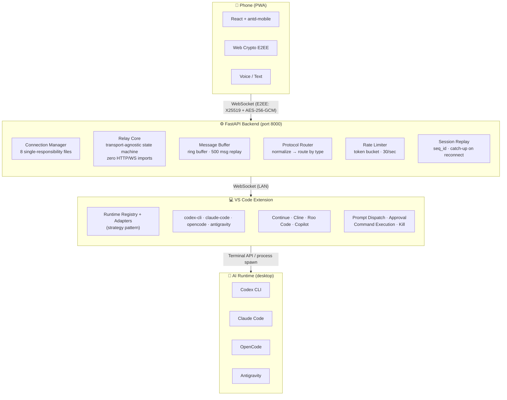

# Pocket Vibe

[](https://github.com/CS-Samuel-hamo/pocket-vibe/releases)
[](LICENSE)
[](https://github.com/CS-Samuel-hamo/pocket-vibe)

**A reference implementation of a mobile remote-control layer for AI coding workflows.**

> Repository: https://github.com/CS-Samuel-hamo/pocket-vibe

Phone → FastAPI WebSocket router → VS Code extension → AI runtime (Codex CLI, Claude Code, OpenCode, etc.).

This is a **teaching-grade open source project** demonstrating how to build a real-time, end-to-end encrypted control plane that spans mobile, server, and IDE boundaries. It is not a commercial product — it is a technical reference.

---

## Architecture



## What Makes This Interesting

This codebase is a case study in several architecture patterns working together:

### 1. Transport-Agnostic Domain Model (`backend/relay_core.py`)

The relay state machine has **zero imports from HTTP or WebSocket**. It accepts injected `clock`, `id_factory`, and `code_factory` dependencies — all state lives in plain dataclasses (`RelaySession`, `RelayDevice`, `RelayMessage`, `PairingChallenge`). This means:

- The entire relay can be unit-tested without opening a single socket
- The same core can be wrapped in HTTP, WebSocket, gRPC, or any transport
- 36 lines of tests cover every edge case in the state machine

**Files to study:** `backend/relay_core.py`, `tests/domain/relay/test_relay_core.py`

### 2. Cross-Platform E2EE (Python + JavaScript)

The same X25519 ECDH + HKDF + AES-256-GCM protocol is implemented in both:

| Layer | File | Tech |
|-------|------|------|
| Python | `src/core/crypto.py` | `cryptography` library |
| Browser | `frontend/src/crypto.js` | Web Crypto API |

Key properties:
- Perfect forward secrecy (ephemeral key pairs per session)
- Matching salt and info strings (`vibe-salt-2026`, `pocket-vive-e2ee`)
- Graceful degradation: falls back to plaintext when `window.isSecureContext` is false or key exchange fails

**Files to study:** `src/core/crypto.py`, `frontend/src/crypto.js`, `tests/test_crypto.py`

### 3. Strategy Pattern for Multi-Runtime Support (`vscode-bridge/src/runtimeAdapters.ts`)

The `RuntimeAdapter` interface defines a uniform contract (`sendPrompt`, `runScript`, `approve`, `kill`, `findTerminal`, `ensureRunning`). The factory function `createRuntimeAdapters` produces **8 adapters**: 4 native terminal runtimes + 4 extension fallbacks, each with a different capability profile.

The companion `RuntimeRegistry` (`runtimeRegistry.ts`) models the runtime lifecycle as:
```
RuntimeDefinition  →  RuntimeDetection  →  RuntimeDescriptor
(immutable config)    (mutable state)       (derived health + UI text)
```

**Files to study:** `vscode-bridge/src/runtimeAdapters.ts`, `vscode-bridge/src/runtimeRegistry.ts`, `vscode-bridge/src/test/runtimeRegistry.test.js`

### 4. Modular Connection Manager (`backend/connection_manager.py` + siblings)

The WebSocket connection lifecycle is decomposed across **8 single-responsibility files**:

| File | Responsibility |
|------|---------------|
| `connection_manager.py` | Orchestration entrypoint |
| `connection_state.py` | Mutable room state |
| `connection_registry.py` | Query/iteration helpers |
| `connection_peers.py` | Room-based peer filtering |
| `connection_disconnect.py` | Cleanup on disconnect |
| `connection_preflight.py` | Pre-connect checks |
| `connection_rooms.py` | Room lifecycle |
| `connection_count.py` | Connection counting / limits |

Dependencies are injected via frozen dataclasses (`ConnectionManagerDependencies`, `ProtocolRouterDependencies`), creating explicit contracts between components.

**Files to study:** All `backend/connection_*.py` files, `backend/connection_manager.py`

### 5. Protocol Router with Defensive Copying (`backend/protocol_router.py`)

Incoming messages flow through a normalization layer that:
- Defensively copies dicts (`dict(message)`) to prevent caller-by-reference mutation
- Normalizes field casing and legacy protocol shapes
- Routes by message type to typed handlers
- Returns structured error events for unknown types

**Files to study:** `backend/protocol_router.py`, `src/domain/models/protocol.py`

### 6. Capability-Driven UI (`frontend/src/`)

The mobile UI adapts to what the connected runtime actually supports. Buttons and features enable/disable based on the runtime's capability report, with clear reasons when something is unavailable. The state machine lives in `runtimeCapabilities.js` and drives the entire UI rendering in `MobileControllerView.jsx`.

**Files to study:** `frontend/src/utils/runtimeCapabilities.js`, `frontend/src/utils/runtimeActionState.js`

## Project Map

```
├── backend/              FastAPI application (entrypoint, WebSocket router, pairing, relay)
│   ├── connection_*.py   Connection lifecycle (8 single-responsibility modules)
│   ├── relay_core.py     ★ Transport-agnostic relay state machine
│   ├── protocol_router.py Message routing by type
│   ├── main.py           App entrypoint (~680 lines, combines DI + routes)
│   └── ...
├── src/                  Shared Python domain layer (hexagonal architecture)
│   ├── core/             Config, crypto, message buffer, rate limiter
│   ├── domain/           Protocol models, driver interfaces, services
│   └── infra/            SQLite persistence
├── frontend/             React PWA (Vite + antd-mobile + Tailwind)
│   ├── src/crypto.js     ★ Browser-side E2EE (matching Python implementation)
│   ├── src/hooks/        WebSocket lifecycle, approval queue
│   ├── src/components/   Mobile controller, tools, console, voice input
│   └── src/utils/        Capability state machine, connection config, preflight
├── vscode-bridge/        VS Code extension (TypeScript)
│   ├── src/runtimeAdapters.ts  ★ 8 runtime adapters (strategy pattern)
│   ├── src/runtimeRegistry.ts  ★ Runtime detection → health → descriptor pipeline
│   ├── src/extension.ts        Extension entrypoint
│   └── src/test/               Unit tests
├── tests/                Python test suite (33 files)
├── docs/                 Architecture decisions, runbooks, release manifests
├── scripts/              Powershell helpers (startup, preflights, gates)
├── infra/                Infrastructure configuration (relay deployment future)
└── .steward/             Project governance definitions
```

★ = files worth studying first

## Quick Start

```bash
# 1. Install dependencies
pip install -r backend/requirements.txt
cd frontend && npm install && cd ..
cd vscode-bridge && npm install && cd ..

# 2. Copy config (optional — defaults work out of box)
cp .env.example .env

# 3. Start backend + PWA (Windows)
./start.ps1

# 4. Open pairing URL in browser, scan QR with phone
#    VS Code extension auto-connects via .pocket-vibe/desktop-connection.json
```

See [QUICKSTART.md](QUICKSTART.md) for detailed setup, [docs/remote_access_guide.md](docs/remote_access_guide.md) for Tailscale/Cloudflare Tunnel setup.

## Verification

```powershell
# Windows prerequisites
.\scripts\check_windows_prereqs.ps1 -SkipFrontendPort

# Python tests (33 files)
pytest tests -q

# Frontend capability tests
cd frontend && npm run test:capabilities

# Bridge compile + tests
cd vscode-bridge && npm run compile && node out/test/runtimeRegistry.test.js
```

## Why "Not a Product"

This project explores what happens when you decouple mobile AI interaction from the desktop IDE without relying on a cloud relay. It demonstrates:

- **No cloud dependency** — the entire stack runs locally; relay is optional and fully self-hosted
- **Privacy by architecture** — E2EE is not an afterthought; it's baked into the protocol from day one
- **Runtime independence** — the control layer does not care which AI tool runs underneath

There are many commercial and open-source solutions in this space (OpenAI Codex Mobile, Claude Code Remote Control, Forge Remote, Hapi, etc.). This project is not competing with them — it exists to show **how such a system can be built**, not to sell one.

## License

MIT License. See [LICENSE](LICENSE) and [CONTRIBUTING.md](CONTRIBUTING.md).
