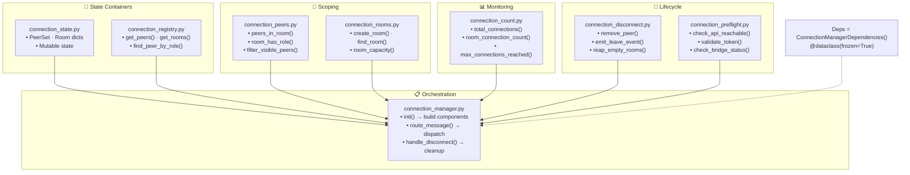

# Connection Manager 模块分解

> `backend/connection_*.py` 的 8 个单职责文件关系图。
> 将以下 Mermaid 代码块渲染为流程图。



### 依赖注入结构

```python
@dataclass(frozen=True)
class ConnectionManagerDependencies:
    connected: dict[str, set[Peer]]    # websocket → peer
    rooms: dict[str, Room]             # room_id → Room
    message_buffer: MessageBuffer      # ring buffer
    rate_limiter: TokenBucket          # 30/sec
    logger: Callable[..., None]        # structured logging
```
