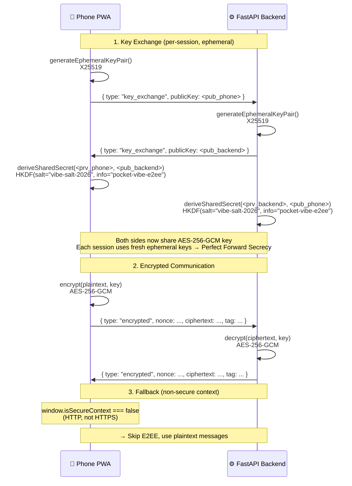

# E2EE 密钥交换时序图

> 用于架构文章。将以下 Mermaid 代码块渲染为时序图。

```mermaid
sequenceDiagram
    participant Phone as 📱 Phone PWA
    participant Backend as ⚙️ FastAPI Backend

    Note over Phone,Backend: 1. Key Exchange (per-session, ephemeral)

    Phone->>Phone: generateEphemeralKeyPair()<br/>X25519
    Phone->>Backend: { type: "key_exchange", publicKey: <pub_phone> }

    Backend->>Backend: generateEphemeralKeyPair()<br/>X25519
    Backend->>Phone: { type: "key_exchange", publicKey: <pub_backend> }

    Phone->>Phone: deriveSharedSecret(<prv_phone>, <pub_backend>)<br/>HKDF(salt="vibe-salt-2026", info="pocket-vibe-e2ee")
    Backend->>Backend: deriveSharedSecret(<prv_backend>, <pub_phone>)<br/>HKDF(salt="vibe-salt-2026", info="pocket-vibe-e2ee")

    Note over Phone,Backend: Both sides now share AES-256-GCM key<br/>Each session uses fresh ephemeral keys → Perfect Forward Secrecy

    Note over Phone,Backend: 2. Encrypted Communication

    Phone->>Phone: encrypt(plaintext, key)<br/>AES-256-GCM
    Phone->>Backend: { type: "encrypted", nonce: ..., ciphertext: ..., tag: ... }
    Backend->>Backend: decrypt(ciphertext, key)<br/>AES-256-GCM
    Backend->>Phone: { type: "encrypted", nonce: ..., ciphertext: ..., tag: ... }

    Note over Phone,Backend: 3. Fallback (non-secure context)
    Note over Phone: window.isSecureContext === false<br/>(HTTP, not HTTPS)
    Note over Phone,Backend: → Skip E2EE, use plaintext messages
```
