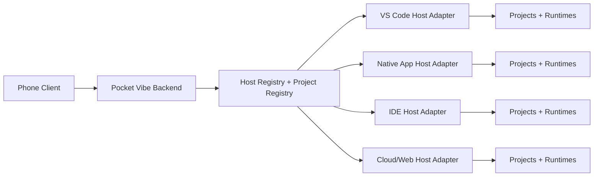

# Pocket Vibe Platform Priority Matrix

Updated: 2026-04-23

## Why This Phase Exists

Pocket Vibe has moved past the single-session demo stage:
- the phone can already control a desktop AI coding session
- the product is now project-aware instead of being tied to one `target_dir`
- the next product question is not "can it work", but "which desktop hosts should it absorb next"

This document is an internal product and engineering decision aid. It is not a market-fact sheet. The ratings below are based on current Pocket Vibe architecture, current user demand in this repo, and adapter leverage.

For the current supported/degraded/unsupported behavior by host and runtime, see [Host Capability Matrix](/D:/AI_projects/Pocket_Vibe/docs/host_capability_matrix.md).

For the selected first non-reference feasibility path, see [First Non-Reference Host Feasibility Plan](/D:/AI_projects/Pocket_Vibe/docs/non_reference_host_feasibility.md).

## Decision Rubric

Each platform family is scored qualitatively against six questions:

1. User density in the target segment.
   Are away-from-desk AI coding users likely to already live here?
2. Control-surface fit.
   Can the host expose prompt dispatch, project identity, file focus, scripts, approvals, and interrupt with a clean contract?
3. Adapter leverage.
   Can one adapter unlock many users or many host variants?
4. Project-registry fit.
   Can the host report stable project metadata and active-runtime state?
5. Commercial leverage.
   Does support here improve the product's likely adoption or paid value?
6. Support cost.
   How expensive will install, recovery, and long-tail debugging be?

## Priority Matrix

| Platform Family | Examples | Product Fit | Adapter Cost | Commercial Leverage | Priority | Decision |
| --- | --- | --- | --- | --- | --- | --- |
| VS Code host ecosystem | `VS Code`, compatible forks, extension-host flows | High | Low | High | Now | Keep as the reference host and use it to harden the shared protocol. |
| Terminal-native AI agents | `codex-cli`, `claude-code`, `opencode`, `antigravity` | High | Low to Medium | High | Now | Treat as the first capability family because they match mobile control well. |
| Native AI coding desktop apps | vendor-specific desktop apps with project/session UI | High | Medium to High | High | Next | Prepare the host protocol now, then validate one concrete native-app adapter. |
| AI IDE variants beyond plain VS Code | Cursor-style or Windsurf-style IDE hosts | Medium to High | Medium | High | Next | Prioritize once the host contract is stable and the first non-reference adapter is selected. |
| JetBrains IDE family | IntelliJ-platform hosts | Medium | High | Medium to High | Next | Worth planning for because of enterprise value, but not before adapter boundaries are proven. |
| Browser/cloud workspaces | hosted browser IDEs, remote dev boxes, cloud agents | Medium | High | Medium | Later | Defer until local-host install, recovery, and trust flows are product-grade. |
| Editor niches | Neovim, Zed, Emacs, Sublime, custom shells | Low to Medium | Medium to High | Low to Medium | Later | Support only after the core adapter families are boringly reliable. |

## Sequencing Rule

Pocket Vibe should not chase platform count. It should expand platform breadth only when each new host satisfies one of these leverage tests:

- one adapter unlocks a large existing user base
- one adapter validates a new host family the product needs strategically
- one adapter creates clear commercial pull from users who need multi-project mobile control

If a candidate host does not pass one of those tests, it belongs on the watchlist, not the roadmap.

## Host Adapter Architecture

## Required Host Contract

Every host adapter should report the same core shape, even if some operations are degraded:

- `host_id`
- `host_label`
- `platform`
- `projects[]`
- `active_project_id`
- `runtime_catalog[]`
- `active_runtime`
- `capabilities`
- `health`
- `last_error`

Every user-facing operation should resolve to one of:

- `success`
- `degraded` with reason
- `unsupported` with reason
- `failed` with reason

That rule matters more than parity. Pocket Vibe does not need every host to support everything. It does need every host to be explicit.

## Capability Buckets

The host contract should normalize these operations:

- `prompt`
- `add_context`
- `open_on_desktop`
- `run_script`
- `approval`
- `kill`
- `project_switch`
- `diagnostics`

Host adapters may implement them differently, but the mobile product should reason in these buckets, not in vendor-specific verbs.

## Rollout Plan

### Phase 1: Reference Host Stability
- Keep `VS Code host + terminal runtimes` as the reference adapter.
- Remove remaining VS Code-specific assumptions from backend routing and project state.
- Make the project registry canonical.

### Phase 2: Project Inbox
- Turn the mobile landing experience into a cross-project inbox.
- Show recent projects, pending approvals, recent failures, and last reply by project.
- Preserve the chat-first surface; do not reintroduce a dashboard maze.

### Phase 3: First Non-Reference Adapter
- Pick one next host family and validate it end to end.
- Preferred order:
  1. one native AI coding desktop app adapter
  2. one AI IDE variant adapter
  3. one JetBrains-family adapter

### Phase 4: Platform Breadth With Rules
- Add new hosts only after the first non-reference adapter proves the contract.
- Publish a support matrix by host family, not just by runtime name.
- Keep mobile simple even as host diversity grows.

## Current Recommendation

The next build phase should be:

1. formalize the desktop host protocol
2. make project registry and routing host-agnostic
3. add a mobile project inbox
4. validate one non-VS Code host family before expanding further
